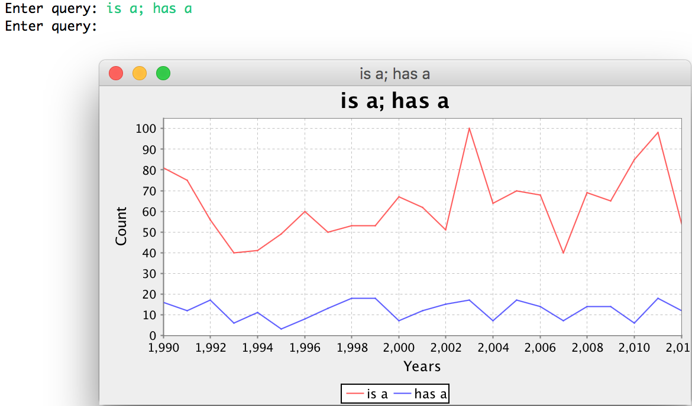

In this assignment you’ll implement a variant on the `Map` interface using the
adapter pattern.  You’ll use the implementation to build an n-gram viewer,
which shows data about common words and phrases in text over time.

You can get the starter code here:

[https://www.dropbox.com/s/70bajyiayai6pn3/pa6-starter-master.zip?dl=0](https://www.dropbox.com/s/70bajyiayai6pn3/pa6-starter-master.zip?dl=0)

## Part I: An Implementation of `DefaultMap`

You’ll provide a fast implementation of an interface called `DefaultMap` in
`DefaultMapImpl.java`.  You can implement it however you like, but we recommend
using one of Java's built in `Map` implementations (like HashMap or TreeMap)
with the adapter pattern.

The special feature of `DefaultMap` is that it will be constructed with a
default value that it returns for keys that aren’t found.  So, for example, a
default map constructed with a 0 default value will return 0 for all keys that
aren’t present:

```
DefaultMap<String, Integer> thisMap = new DefaultMapImpl<>(0);
assertEquals(0, (int)thisMap.get("C"));
assertEquals(0, (int)thisMap.get("A"));
thisTree.set("C", 3000);
assertEquals(3000, (int)thisMap.get("C"));
assertEquals(0, (int)thisMap.get("A"));
```

In addition, if `null` is provided as the default value, any attempt to get a
key that isn’t set should result in a `NoSuchElementException`:

```
DefaultMap<String, Integer> thisMap = new DefaultMapImpl<>(null);
thisMap.get("A"); // Throws NoSuchElementException
```

You will implement all the methods defined in the `DefaultMap` interface. You
must ensure that each has the specified big-O bound in the average case, and
argue why based on the documentation of any libraries you use, or based on your
implementation. Note that these are big-O bounds, so doing _better_ (like O(1)
where O(log(n)) is required) is acceptable. In each, _n_ represents the number
of entries in the map.

- `set`, required _O(log(n))_
- `get`, required _O(log(n))_
- `containsKey`, required _O(log(n))_
- `keys`, required _O(n)_
- `values`, required _O(n)_
- `size`, required _O(1)_
- `defaultValue`, required _O(1)_

`DefaultMapImpl` should have a single constructor that takes one argument (the
default value).

Their specifications are defined in header comments in the `DefaultMap.java`
file, which you should follow. You may use any methods on in the Java
collections library to implement them (including helpers like
`Collections.sort`). If you don't know how to use a particular library method,
interface, or class in the standard Java utils, ask! This is an opportunity to
learn about the built-in libraries. You may find these useful:

- [`HashMap`](https://docs.oracle.com/en/java/javase/11/docs/api/java.base/java/util/HashMap.html)
- [`Set`](https://docs.oracle.com/en/java/javase/11/docs/api/java.base/java/util/Set.html)
- [`Collection`](https://docs.oracle.com/en/java/javase/11/docs/api/java.base/java/util/Collection.html)

The pages linked from those may also have useful information.  Your
implementation of `DefaultMap` will be graded automatically by tests that we
provide. We’ll provide a subset of the tests in the grader.

## Part II: An N-Gram Viewer

An n-gram is a sequence of N adjacent words in a document. The 1-grams (when
N=1) in a document are just all the words within it. The 2-grams are all the
sequences of two adjacent words, and so on. Here’s an example:

    this sentence is an example sentence

- 1-grams: `"this"`, `"sentence"`, `"is"`, `"an"`, `"example"`, `"sentence"`
- 2-grams: `"this sentence"`, `"sentence is"`, `"is an"`, `"an example"`, `"example sentence"`
- 3-grams: `"this sentence is"`, `"sentence is an"`, `"is an example"`, `"an example sentence"`

One way that text is analyzed is by breaking it into n-grams and counting the
frequency at which various n-grams appear. Breaking this data into a _time
series_ is particularly interesting – how do particular terms change in
frequency in documents over time?

Your task is to build the data structures needed to load a corpus of n-grams
and visualize them. You will build several methods in a class called `Loader`
to load a corpus of words, and then use a graphing library to plot them. You
will use the implementation of `DefaultMap.java` to do so.


The data is a sample of English language from the years 1990 to 2012,
containing a few million words in total. It is the [COCA sample from this web
site](https://www.corpusdata.org/formats.asp). It is laid out in plain text
files within a single directory, and the filenames all have the format:

```
w_<type>_<year>.txt
```

Where `<type>` says something about the source of data (interesting, but not
relevant for the assignment), and `<year>` says what year the data is from.
For example `w_mag_1991.txt` contains snippets of text from magazines in 1991,
and `w_fic_2002.txt` contains snippets from fictional works in 2002.

The files themselves each contain several lines with text and other
formatting characters on them, for example:

```
##4000054 Section : Features Research sheds new light on the origin of humanity 's most intimate quadruped ally <p> The poor dog , " wrote poet Lord Byron in a flight of emotion , " in life the firmest friend , The first to welcome , foremost to defend . " And certainly , few animal lovers would care to differ . The dog , after all , is commonly referred to as man 's best friend , and unquestionably serves a wide range of human purposes . Thanks to artificial selection , there are dogs that guard houses and dogs that herd livestock , dogs that locate game birds for shooting and dogs that retrieve game birds that have been shot , dogs that pull sleds and dogs that sit languidly in human laps . <p> Clearly , the relationship between dog and human runs deep in our culture and our psyches . No surprise , then , that the origin of the domestic dog has long been a matter for speculation and inquiry . But now , new techniques of molecular biology are allowing researchers to trace @ @ @ @ @ @ @ @ @ @ ways previously unavailable to traditional wildlife biologists , taxonomists , and archeologists . Investigators are making great strides in understanding the origin of the domestic dog , even though results are often subject to dispute and controversy , as might be expected of research on a creature that is genetically complex . <p> " No other species is so diverse , " says Robert Wayne , a University of California-Los Angeles evolutionary biologist who has just completed the largest study ever on dog genetics and evolution . " Dogs are a model for how rapid morphological change might take place in a natural population . " They also offer clues as to how genetic vigor can be maintained in domestic species . <p> One of the key questions of dog evolution focuses on the source : From what wild creature did the domestic dog arise ? Charles Darwin suggested that the close relationship between wolves , coyotes , and jackals-all of which can interbreed-so muddies questions of which species yielded the dog that " we shall probably never be able to ascertain the dog 's origins with certainty . " Austrian @ @ @ @ @ @ @ @ @ @ 
```

You'll notice a few things about the format:

- Punctuation has spaces added around it
- There are series of `@` characters used to separate passages
- There is an id number (irrelevant for this assignment) at the beginning of each line

This format where be your source for retrieving the n-grams from the data
set, and these files are all in the directory `data/` included with your
repository.  Your program will consume this data and produce graphs like
this:



That is, a user can type in multiple n-grams separated by semicolons, and your program will produce a graph that shows the relationship.

### Required Methods

You _must_ implement the two following methods:

```
public static DefaultMap<Integer, DefaultMap<String, Integer>> generateDatabase(Path p)

public static Graph makeGraph(
  DefaultMap<Integer, DefaultMap<String, Integer>> db,
  String[] query)
```

#### generateDatabase

The idea here is that `generateDatabase` produces a useful structure that can
be efficiently _queried_ later to produce a graph.

`generateDatabase` should map from _years_ to maps from _n-grams_ to _counts_.
That is, the structure might represent something like:

```
1991 => { "is" => 30, "is a" => 10, "has a" => 20, ... }
1992 => { "is" => 45, "is a" => 12, "has a" => 25, ... }
1993 => { "is" => 60, "is a" => 13, "has a" => 28, ... }
```

So there will be one entry in the map for each _year_ of data, and one entry in
each year's map for each n-gram that appeared at least once in that year's data.

The `Path` that `generateDatabase` takes as an argument should be a path with a
directory structure like `data`. The expectation is that the directory holds
files of the shape described above (`w_<type>_<year>.txt`). The
`generateDatabase` method should read all the files in this directory (see
“Reading Files” below), split them up on word boundaries, filter out non-word
strings (see “Filtering Strings” below), and build a map as described above.

You should add all 1- through 3-grams in the documents to the map (ignore grams
of 4 and above). Note that there are multiple files from each year, for example
both `w_acad_1990.txt` and `w_fic_1990.txt` represent text from the year 1990.
You should make sure to include n-grams from all the files corresponding to a
given year in the map for that year.

We will test your `generateDatabase` with other directories than the given data
directory, and you may find it useful to do so as well. The test data we use
will have the expected layout above.

#### makeGraph

Once you've built the database, you can use it to ask interesting questions,
like how many times a several particular n-grams appeared in each year from
1990 to 2012 in the dataset. We've provided you with a class `Graph` that uses
an open-source chart library to draw the graphical elements, but it needs to be
constructed with the right input data to work. You will write `makeGraph` to
take a database of the shape constructed by `generateDatabase` along with a
query as an array of n-grams, and produce the corresponding `Graph`.

A query is an _array_ of n-grams to plot, so, for example, to query for
the n-grams "is a" and "has a", the array argument would be:

```
new String[]{"is a", "has a"}
```

The individual n-grams themselves are represented simply as space-separated
words.

The goal of `makeGraph` is to construct a `Graph`, whose constructor has the
following signature:

```
public Graph(String title, List<Integer> years, DefaultMap<String, List<Integer>> data)
```

- The `title` parameter is simply the name that appears at the top.
- The `years` parameter is a `List` containing all the years to be plotted
- The `data` parameter is a map from n-grams to lists of _counts_ of the
  n-grams, with one element in the list for each year in `years`. For example,
  if the `years` were 1991, 1992, and 1993, the map might represent:

      "is a" => [34, 67, 92]
      "has a" => [44, 55, 33]
  
  where there were `34` instances of `"is a"` in 1991, `55` of `"has a"` in
  1992, and so on.

The `Graph` constructor can then plot the information (see “Plotting” below).
Note that for the automatically graded part of the assignment, we will simply
check that you created the correct `Graph` object.

### Reading Files

You're free to read in the files in any way you like. We found the following
methods particularly useful:

- [`FileSystems.getDefault().getPath()`](https://docs.oracle.com/javase/7/docs/api/java/nio/file/FileSystem.html#getPath(java.lang.String,%20java.lang.String...))
  for getting a `Path` object from a string. Providing the path to the
  directory containing the test data may be useful, for example.
- [`Files.newDirectoryStream()`](https://docs.oracle.com/javase/7/docs/api/java/nio/file/Files.html#newDirectoryStream(java.nio.file.Path)),
  which returns an iterator over the paths in a directory
- [`Files.readAllLines()`](https://docs.oracle.com/javase/8/docs/api/java/nio/file/Files.html#readAllLines-java.nio.file.Path-),
  which gives back a `List<String>` containing all the lines in a file represented by a given path.

We didn't need any more than these for the reference implementation. Here's an
example of a class that you could add to your implementation that shows an
example of using these APIs. There's a few things worth noting:

- We added `throws IOException` to `main` here. This tells Java that if a file
  or directory isn't found, `main` might just quit with an exception
- The `if` within the loop is just to demonstrate what the paths look like, and
  to show what printing out/reading a single file looks like. There's nothing
  special about that individual file.
- You can use `toString` on a path to get a `String` representation of it. This
  can be useful for finding out which year a file refers to, since the year
  will always appear just before the `.txt`

```
package cse12pa6student;

import java.io.IOException;
import java.nio.file.DirectoryStream;
import java.nio.file.FileSystems;
import java.nio.file.Files;
import java.nio.file.Path;
import java.util.Arrays;

public class ReadSomeFiles {
	public static void main(String[] args) throws IOException {
		Path path = FileSystems.getDefault().getPath("./data");
		DirectoryStream<Path> d = Files.newDirectoryStream(path, "*.{txt}");
		for(Path p: d) {
			System.out.println("The path is: " + p);
			if(p.toString().equals("./data/w_acad_1992.txt")) {
				System.out.println(Files.readAllLines(p));
			}
		}
	}
}
```

### Filtering Strings

The data within each file has extraneous information in it. For example, there
are sequences of `@` signs separating passages, punctuation like `.`, and
paragraph markers like `<p>`. In addition, some words are in uppercase and some
are in lowercase. You should filter out this extraneous information to get the
most useful sequence of n-grams you can.

_This process not be graded automatically, but by reading your code and your
argument for it._ You should argue in your README about why your filtering
rules were good (see the README section below). Note that this requires
exercising your judgment, which we cannot do for you, so “Is this filtering
rule OK?” kinds of questions need to come with an argument. We will autograde
your submission on pre-filtered data that doesn't have this extraneous
information, so that your filtering rules won't affect that part of your grade.

A reasonable approach to this is to break up each line on spaces to produce an
array or list (using `String.split`), and then remove some of the
space-separated strings according to string matching rules you develop. Some
things to think about:

- Should an n-gram span across sentences?
- Should an n-gram span across comma boundaries?
- Should capitalization distinguish words or n-grams?
- Should words with apostrophes be considered words or not?

Note that when we **test** your code for correctness, we'll focus on providing
input that is in all lowercase with no punctuation. The string filtering you do
will be graded manually and based on your arguments and judgment.

### Main and Plotting

You will also implement a `main` method that:

- Loads the provided sample data
- Runs a simple loop:
  - taking user input as semicolon-separated lists of n-grams
  - showing the user a plot of the results

So, _before_ the loop you should use `generateDatabase` once to create the data
to query, then you can start the loop, and use `makeGraph` to show the
responses.

Our loop looks something like:

```
database = generateDatabase(...);
Scanner in = new Scanner(System.in);

while(true) {
  
  System.out.print("Enter query: ");
  String query = in.nextLine();

  ... split query ...

  Graph g = makeGraph(database, queryArray);
  g.showChart();
}
```

This allows you to interactively explore relationships – this is a pretty
useful data exploration tool! If you wanted to take this further, you could
expand the set of data files you read in, you could build a visualizer for data
from many different sources.

## README

You will write a README to answer the following questions:

- For each method in `DefaultMapImpl`, argue why its performance meets the
  specified required bound.
- Justify your filtering process. Write 3-5 sentences and give 2-3 examples of
  important filtering rules you came up with to go from the space-separated
  strings in a file to the n-grams your viewer shows.
- Discuss the runtime of loading the dataset, answering the following
  questions: How much real time (milliseconds) does it take to load all the
  sample data (e.g.  `generateDatabase`)? What is its asymptotic complexity in
  terms of a tight big-O bound? In particular, how do you describe the input
  size?
- Discuss the runtime of querying the dataset (e.g. creating a graph),
  answering the following questions: How much real time (milliseconds) does it
  take for some sample queries? How do the n-grams queried for affect the
  runtime? What is the asymptotic complexity of **performing a query** in terms
  of a tight big-O bound? In particular, how do you measure the size of the
  input?

## Grading and Submission

### Style

This PA has the same style guidelines as PA5.

- Lines **must not** be longer than 100 characters except for method headers
- Indentation must be consistent
- Test method names must have meaning related to the test
- Lines **must not** be indented more than 6 times. If you have a need to
  indent more than 6 levels, build a helper method or otherwise reorganize your
  code
- Helper method names should describe their purpose
- If you write a helper method with a body longer than 2 statements, **you
  must** add a header comment (a comment above the method) that summarizes what
  it does in English

### Rubric

50 total points

- 11 points: implementation of `DefaultMap` [automatically graded]
- 22 points: n-gram viewer
  - 10 points for `generateDatabase` [automatically graded]
  - 8 points for `makeGraph` [automatically graded]
  - 4 points for `main` [manually graded]
- 12 points: README [manually graded]
- 5 points: Style [manually graded]

There is no bad implementation testing on this PA. However, we highly recommend
you use the practices you know from testing to thoroughly check that
`DefaultMapImpl` and the n-gram helpers you wrote work as expected.

